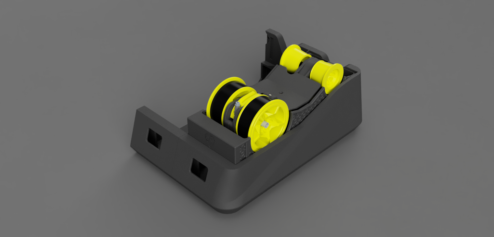
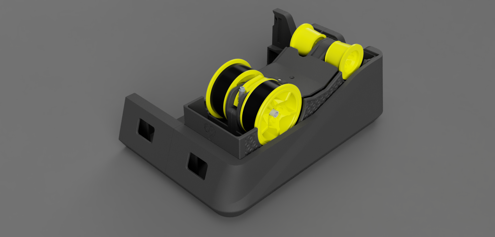

# EMU Convertible

This mod allows the use of wider spools. In the outer bays of the base or in the center with an adjacent bay populated, 84 mm spools can be used. Even wider spools can be used in the center without side bays.
  
It is fully compatible, so only the EMU filamentalist needs to be replaced to eliminate the need for calibration.

| Front 45° | Closed Front | Opened Front |
|---|---|---|
|  |  |  |

by Dragi2k
