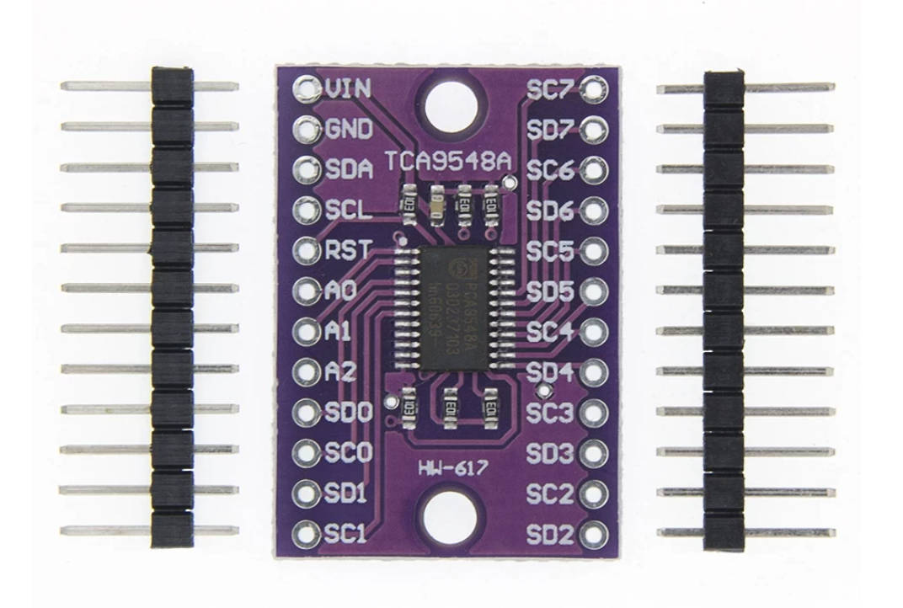
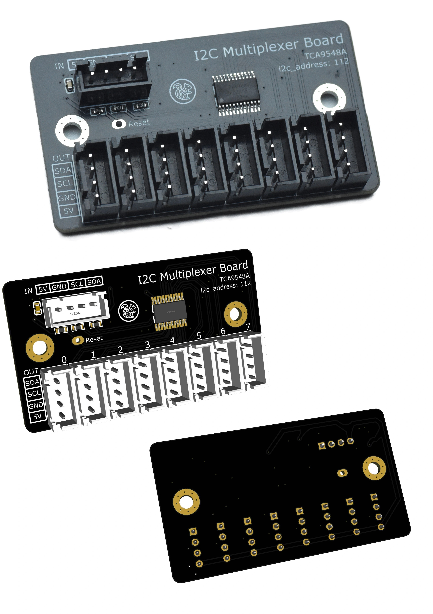

# EMU I2C MUX Board

This user mod is a small PCB for wiring a TCA9548A I2C multiplexer into an
EMU setup more cleanly.

## Why

Some users may want to repurpose spare MMU controller boards, such as the MMB
or AFC-Lite, to build an EMU. In these configurations, convenient I2C connection 
points can run short when multiple I2C devices are connected. A TCA9548A multiplexer 
allows several downstreamI2C devices to share a single upstream I2C bus while keeping 
the devices isolated on separate mux channels.

This board was made to make that wiring easier and cleaner.

**Note:**

> Compared with the common off-the-shelf TCA9548A breakout board, this PCB does
> not add any new electrical or software functionality. Its purpose is only to
> simplify and organize the wiring for an EMU installation.

  

## Hardware

**Gerber** files for the PCB are included in this project, allowing you to order the board from 
your preferred PCB manufacturer.

Alternatively, you can purchase a PCB from AliExpress. Ordering it together with other EMU 
parts can help reduce shipping costs.

- https://www.aliexpress.com/item/1005011529532141.html

  

## Mount
The PCB mount designed for EMU Lane Base is also available in this repository.

## Software

The matching Klipper software add-on is maintained separately:

<https://github.com/jacksky6/TCA9548A-klipper-addon>

That software project provides the actual TCA9548A mux support for Klipper,
including serialized channel selection and sensor adapters for devices behind
the mux. This PCB is only a wiring convenience board. It does not replace the
software add-on.

## License

This user mod is licensed under the Creative Commons
Attribution-NonCommercial-ShareAlike 4.0 International license.

See: <https://creativecommons.org/licenses/by-nc-sa/4.0/>
