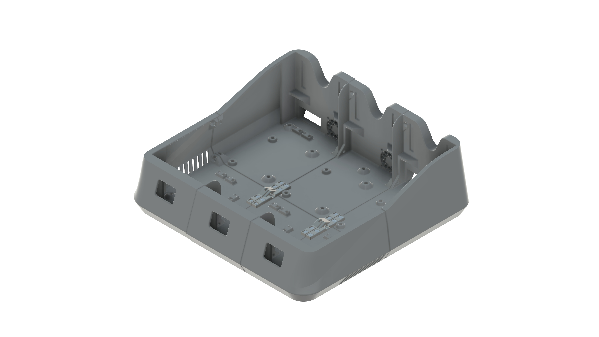
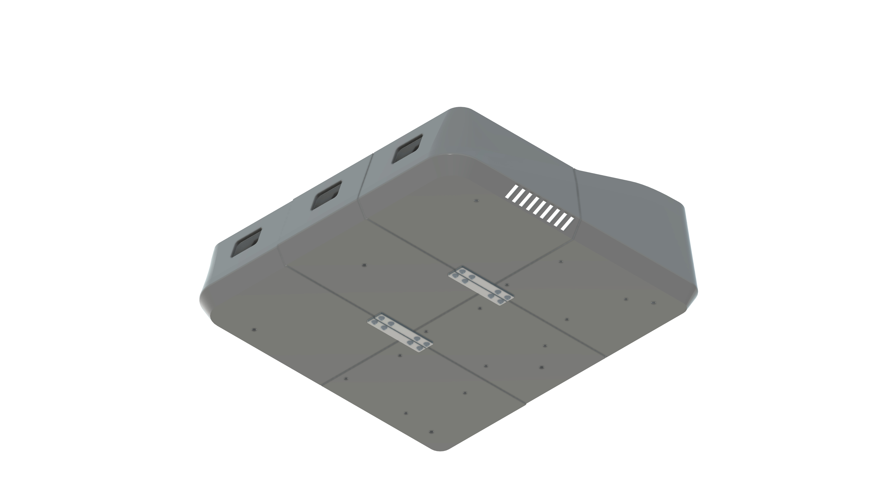

# EMU Split base

> [!WARNING]  
> Highly experimental & untested

| Top view | Bottom view |
|---|---|
|  |  |

A remix splitting the different base parts so they can be printed on smaller printers.

The position of the side connector matches of original position, so mixing split bases with full bases it possible.

> This mod adds some protrusion (~4mm) on the bottom, so feet are required (even if they are already part of the standard bom).

## Extra required bom

The M3x8 SHCS screw + square nut to interconnect the lanes is already in the base bom so it's not needed as 'extra' for each lane.

### Left and right lane
These are the extra requirements for a single side, multiply by 2 if printing both sides

|Amount | Part | Placement |
|---|---|---|
| 2x | M3x8 SHCS | On outer side of the box | 
| 4x | M3x8 BHCS | On bottom of the inner side connector |
| 4x | Square nuts | On the top the inner side connector |

### Middle lane(s)

|Amount | Part | Placement |
|---|---|---|
| 8x | M3x8 BHCS | On bottom of the side connectors |
| 8x | Square nuts | On the top the side connectors |

## Credits
- Original mod by [martijnvanduijneveldt](https://github.com/martijnvanduijneveldt)
