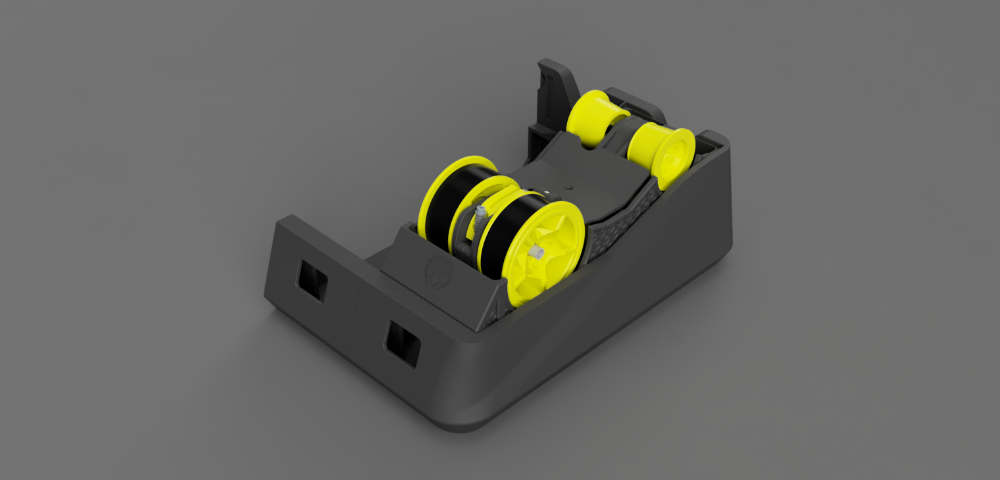
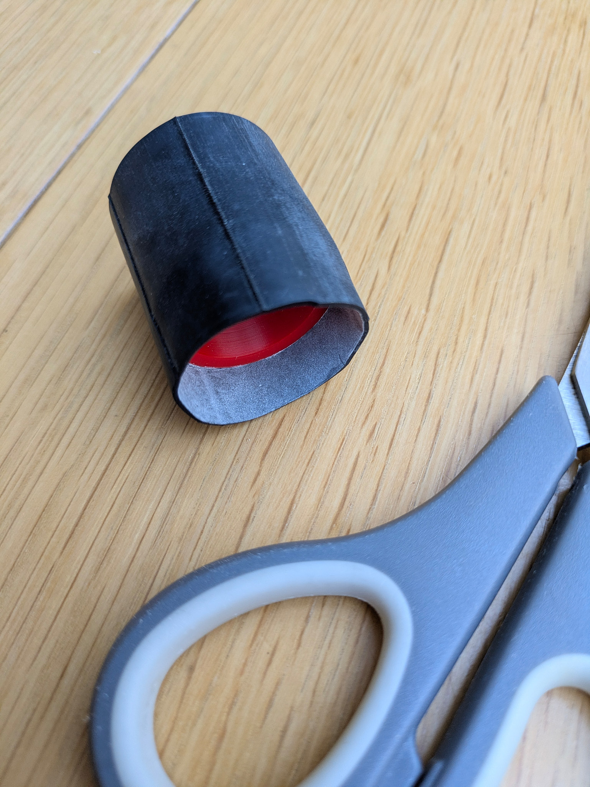
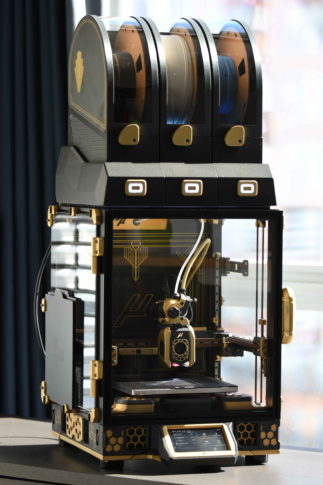

# EMU User Mods

Community-contributed modifications and additions for the EMU (Expandable Multi-material Unit). Browse the table below to find mods that extend or customise your EMU setup.

## Usermods

| Mod | Author | Description | Preview |
|-----|--------|-------------|---------|
| [DFRobot SHT31 Holder](DFRobot_SHT31_Holder) | [reapola](https://github.com/reapola) | High-accuracy temperature & humidity sensor holder, replacing the standard BME280 |  |
| [EMU Cable Entry – Crimpable JST](EMU%20Cable%20Entry_Crimpable_JST) | [Dragi2k](https://github.com/Dragi2k) | Cable entry module with crimpable JST socket options for 3- and 4-pin configurations |  |
| [EMUSync Mount](EMUSync_Mount) | [cwiegert](https://github.com/cwiegert) | Mount to stabilise the PSF body in the bowden path with perpendicular or parallel mounting options |  |
| [EMU Cable Entry Blank Plate](EMU_Cable_Entry) | [bartlammers](https://github.com/bartlammers) | Blank cable entry plate for sides without cables, compatible with multimaterial printing |  |
| [EMU Convertible](EMU_Convertible) | [Dragi2k](https://github.com/Dragi2k) | Use wider spools (84 mm) in outer bays or centre with the adjacent bay populated |  |
| [EMU F1 Wheels](EMU_F1%20Wheels) | [Dragi2k](https://github.com/Dragi2k) | Stylish wheel remix compatible with EMU Lite and EMU Convertible for wider wheel accommodation |  |
| [EMU Lite](EMU_Lite) | [Dragi2k](https://github.com/Dragi2k) | Simplified EMU without lid or base, fully compatible with EMU Filamentalist and hatch board |  |
| [EMU Roller Rubber Installer](EMU_Roller_Rubber_Installer) | [wil1972](https://github.com/wil1972) | Tools for cutting and installing rubber bike tyre on EMU rollers using zip ties |  |
| [Micron EMU Hat](MicronEMU) | [burkfers](https://github.com/burkfers) | Base unit mod fitting three EMU boxes onto a Micron with a stealth aesthetic |  |
| [Rim Roller with Square Nuts](Rim_Roller_with_square_nuts) | [martijnvanduijneveldt](https://github.com/martijnvanduijneveldt) | Rim roller remix using square nuts instead of screwing directly into plastic |  |
