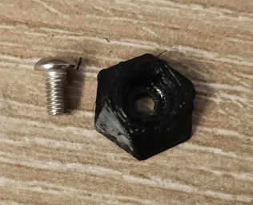
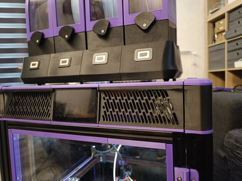

# Printable feet

This small print adds reasonably low profile feet to the EMU. They can be printed in a flexible material to absorb some vibrations (especially when placed on top of the printer) and provide grip.

They have been tested in 95A TPU, printed with one wall, three tops and bottoms, and 10% gyroid infill.

Mount with an M3x6 BHCS each. Do not overtorque flexibles!

## Acknowledgements

Thanks to hartk for the inspiration by way of his Micron hexagonal feet.
